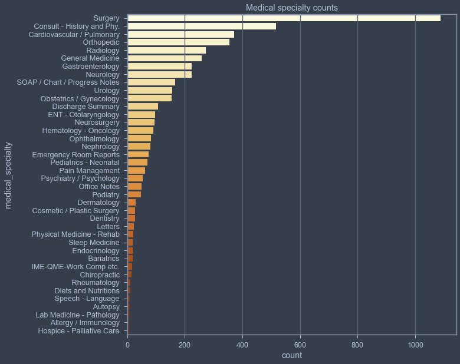
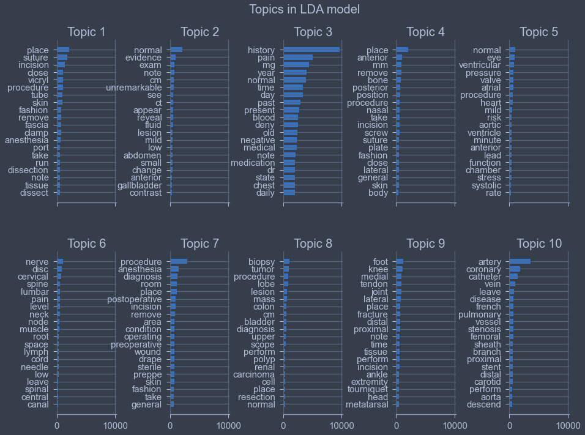
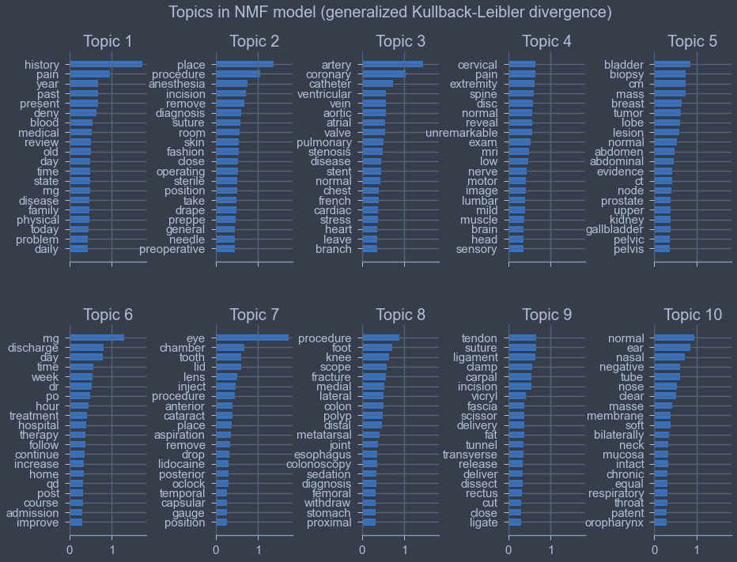

# Healthcare Text Topic Modeling: Comparing NMF and LDA on Clinical Transcriptions

## Overview

This project is topic modeling on real clinical medical transcription text from mtsamples.com. The use case is to discover higher-level medical categories from the unstructured text data. For example: surgery, oncology, cardiovascular, rather than the 40 granular specialty labels that already exist in the data.

The high level approach is to compare three topic modeling approaches: NMF with Frobenius norm loss, NMF with generalized Kullback-Leibler divergence loss, and Latent Dirichlet Allocation (LDA).

This project has thoughtful column-selection rationale, an interesting validation method, and data-driven stopword refinement.

## Dataset and Approach

### Dataset and Column Selection

The data consists of 4,999 medical transcriptions from [mtsamples.com](http://mtsamples.com) across 40 medical specialties, with Surgery having the largest number of samples (~1,000) and then a diminishing tail of other categories. Of the various text columns to attempt to model, description and sample_name were too short, the keywords column appeared to be a derived text analytics product, and medical_specialty was close but too granular (40 labels). Transcription was the best raw text candidate to attempt topic modeling.

### Cleaning Pipeline

Python's spaCy was used for text cleaning (lemmatization, stopword removal, custom regex filtering for non-alphabetic tokens). Because I was on a business trip at the time of development, I cleaned the data once and cached it to disk so the work would survive across sessions with limited compute access.

### Validation and Stopword Refinement

Prior to topic modeling, the top-20 word frequencies per medical specialty were computed. This provided a semi-ground-truth to validate if the model outputs resembled real specialty-level language patterns. The exploratory data analysis revealed that words like "patient", "history", "right", and "left" appear in every specialty's top words and were not useful for differentiating topics. They were removed and a second cleaned column was created.

## Results

Topics were somewhat similar across all three methods (both NMF variants and LDA). Subjectively, I found the LDA topics to be most interpretable. The final topic labels were of my own creation and not based on the medical_specialty column.

| Topic | Interpretation |
|---|---|
| 1 | Surgery |
| 2 | Medical imaging |
| 3 | Patient history |
| 4 | Condition/injury positioning |
| 5 | Cardiovascular: blood pressure |
| 6 | Spine |
| 7 | Surgery (again) |
| 8 | Oncology |
| 9 | Orthopedics/podiatry |
| 10 | Cardiovascular: heart |

*The NMF (KL divergence) topics show similar themes to LDA but were subjectively less clean/interpretable.*

## Extensions / What I'd Do Differently

This project was completed during my Master's program. With my current experience, there are a few things I'd approach differently:

- Topic coherence metrics (C_v, UMass, etc.) for quantitative topic selection instead of my subjective method.
- BERTopic, a modern embedding-based approach to topic modeling. I used this in [a later project](https://github.com/DarrellS0352/Combined-Guided-Topic-Modeling-Based-and-Aspect-Based-Sentiment-Analysis-For-Book-User-Reviews), which could serve as a natural extension to this one.
- Hyperparameter tuning of `n_components`. It is currently fixed at 10, and coherence scores could guide selecting the number of topics rather than choosing it arbitrarily.
